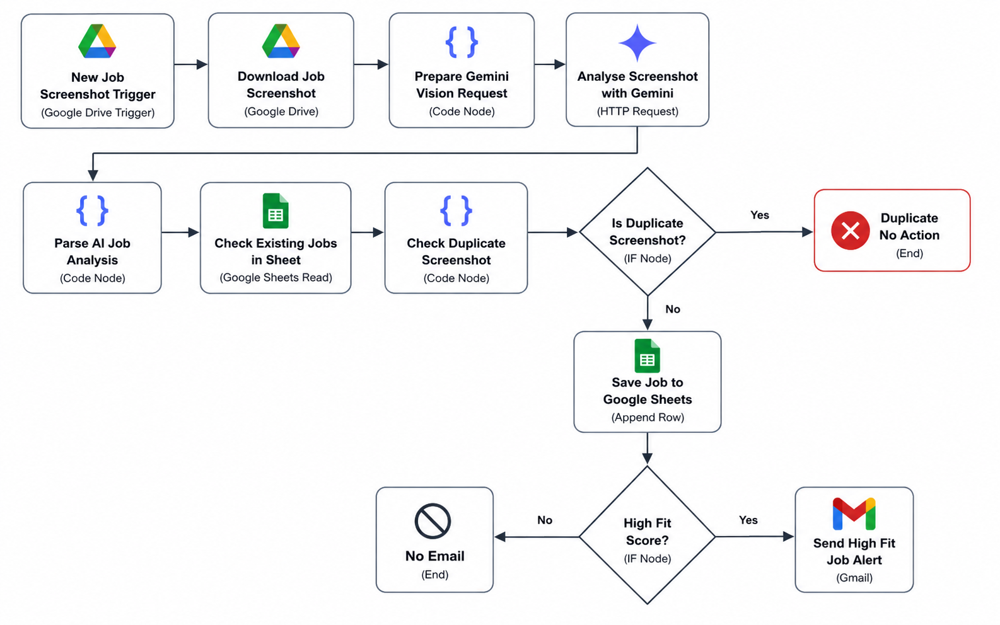
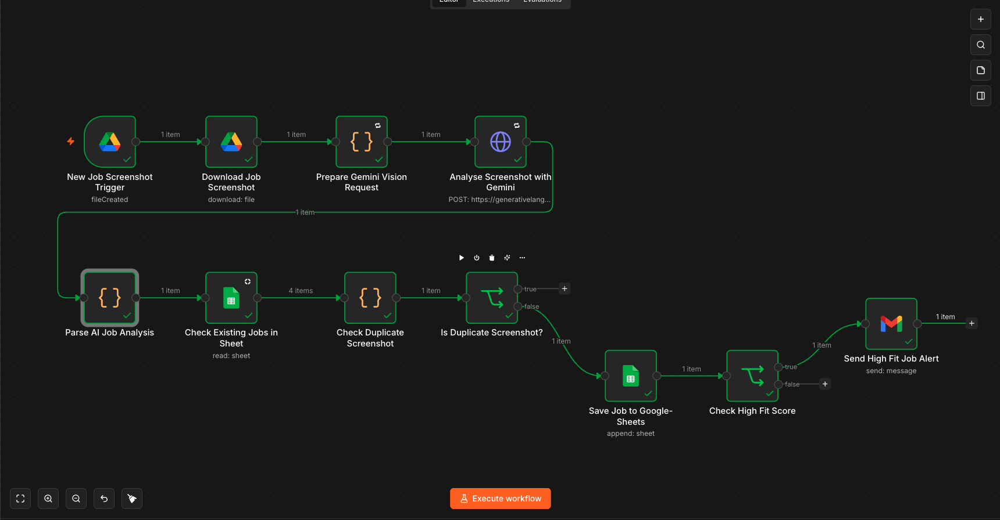
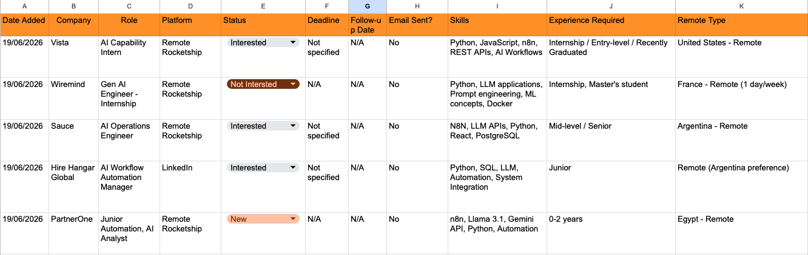
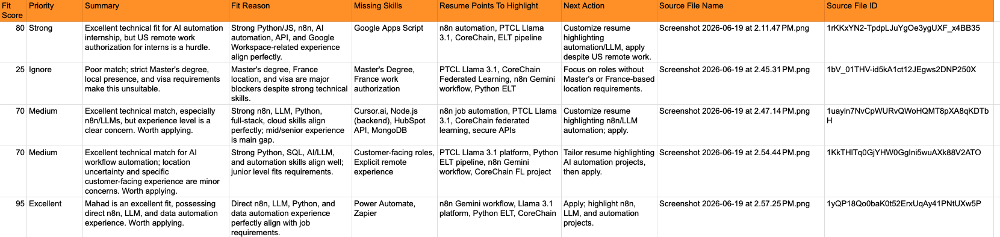
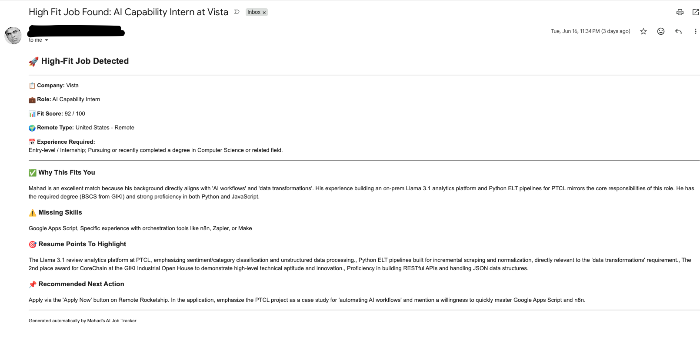

# AI Job Application Automation Platform

An AI-powered n8n workflow that automates job discovery and tracking from job screenshots. The system extracts job details using Gemini Vision, evaluates candidate-job fit, stores structured results in Google Sheets, prevents duplicates, and sends email alerts for high-fit roles.

## Overview

This project was built to automate part of the job application workflow. Instead of manually reading job posts, copying details, scoring relevance, and tracking applications, the workflow processes job screenshots and converts them into structured, actionable job records.

## Features

- Watches a Google Drive folder for new job screenshots
- Downloads uploaded job screenshots automatically
- Sends screenshots to Gemini Vision for job post analysis
- Extracts company, role, skills, experience requirements, remote type, and deadline
- Scores job fit against a candidate profile
- Classifies opportunities by priority
- Generates concise AI summaries and next actions
- Detects duplicates using source file ID and company-role matching
- Stores structured results in Google Sheets
- Sends Gmail alerts for high-fit roles

## Tech Stack

- n8n
- Google Drive
- Google Sheets
- Gmail
- Gemini Vision API
- JavaScript Code Nodes
- JSON Parsing
- Prompt Engineering
- Workflow Automation

## Architecture

## Workflow

## Sample Output

## Email Alert

## Workflow Logic

The workflow follows this process:

1. A job screenshot is uploaded to a Google Drive folder.
2. n8n detects the new file using a Google Drive Trigger.
3. The screenshot is downloaded and converted into a Gemini-compatible request.
4. Gemini Vision extracts structured job information.
5. A JavaScript Code node parses the AI response into clean JSON.
6. The workflow assigns a fit score and priority.
7. Existing Google Sheets rows are checked for duplicates.
8. New jobs are saved to Google Sheets.
9. High-fit jobs trigger an email alert.

## Duplicate Detection

The workflow prevents duplicate entries using two checks:

- Source File ID match
- Company + Role match

This helps avoid duplicate records when the same screenshot or same job is uploaded multiple times.

## Example Fields Extracted

- Company
- Role
- Platform
- Experience Required
- Remote Type
- Fit Score
- Priority
- Summary
- Fit Reason
- Missing Skills
- Resume Points to Highlight
- Next Action
- Source File Name
- Source File ID

## Security Note

API keys, OAuth credentials, and private Google account credentials are not included in this repository. The workflow file is redacted and requires users to configure their own n8n credentials.

## Future Improvements

- Add error workflow for failed Gemini/API calls
- Add automatic retry handling
- Add batch processing for existing screenshots in a folder
- Add clickable Google Drive source links
- Add dashboard analytics for job search insights
- Generate tailored cover letters and recruiter messages

## Project Status

Working prototype. Built for personal job tracking and portfolio demonstration.
